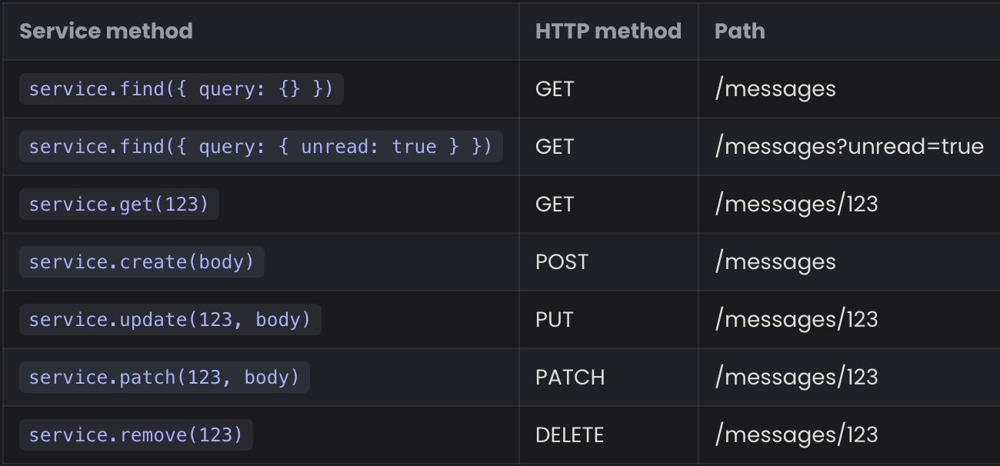
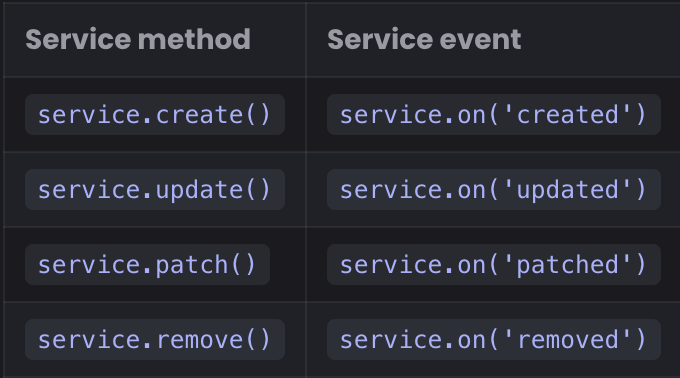

# Getting Started with Feathers.js

## Quick Start
- Feathers currently works will all active Node.js releases.
- Since feathers is a node application, create a default package.json using NPM:
```sh
npm init --yes
# Install TypeScript and its NodeJS wrapper
npm i typescript ts-node @types/node --save-dev
# Also initialize a TS configuration file that uses modern JavaScript
npx tsc --init --target es2020
```

### Installing Feathers
- Feathers can be installed via the `npm` command.
```sh
npm install @feathersjs/feathers --save
```

### Our first app
- Let's make a simple messages service:
```ts
import { feathers } from '@feathersjs/feathers'

// This is the interface for the message data
interface Message {
  id?: number
  text: string
}

// A messages service that allows us to create new
// and return all existing messages
class MessageService {
  messages: Message[] = []

  async find() {
    // Just return all our messages
    return this.messages
  }

  async create(data: Pick<Message, 'text'>) {
    // The new message is the data text with a unique identifier added
    // using the messages length since it changes whenever we add one
    const message: Message = {
      id: this.messages.length,
      text: data.text
    }

    // Add new message to the list
    this.messages.push(message)

    return message
  }
}

// This tells TypeScript what services we are registering
type ServiceTypes = {
  messages: MessageService
}

const app = feathers<ServiceTypes>()

// Register the message service on the Feathers application
app.use('messages', new MessageService())

// Log every time a new message has been created
app.service('messages').on('created', (message: Message) => {
  console.log('A new message has been created', message)
})

// A function that creates messages and then logs
// all existing messages on the service
const main = async () => {
  // Create a new message on our message service
  await app.service('messages').create({
    text: 'Hello Feathers'
  })

  // And another one
  await app.service('messages').create({
    text: 'Hello again'
  })

  // Find all existing messages
  const messages = await app.service('messages').find()

  console.log('All messages', messages)
}

main()
```
- To run it, use this command: `npx ts-node app.ts`
- Only `find` and `create` are implemented, but the other methods can be implemented as well.

### An API Server
- Feather Transports allows for the created as an API server instead of a simple node.js script.
- In the nest example, the following packages are used:
  - `@feathersjs/koa` - which uses [KoaJS](https://koajs.com/) to turn the service into a REST Api.
  - `@feathersjs/socketio` - Uses Socker.io to do the same functionality as a WebSocket.
- Here is the install command:
```sh
npm install @feathersjs/socketio @feathersjs/koa --save
```
- The example becomes:
```ts
import { feathers } from '@feathersjs/feathers'
import { koa, rest, bodyParser, errorHandler, serveStatic } from '@feathersjs/koa'
import socketio from '@feathersjs/socketio'

// This is the interface for the message data
interface Message {
  id?: number
  text: string
}

// A messages service that allows us to create new
// and return all existing messages
class MessageService {
  messages: Message[] = []

  async find() {
    // Just return all our messages
    return this.messages
  }

  async create(data: Pick<Message, 'text'>) {
    // The new message is the data text with a unique identifier added
    // using the messages length since it changes whenever we add one
    const message: Message = {
      id: this.messages.length,
      text: data.text
    }

    // Add new message to the list
    this.messages.push(message)

    return message
  }
}

// This tells TypeScript what services we are registering
type ServiceTypes = {
  messages: MessageService
}

// Creates an KoaJS compatible Feathers application
const app = koa<ServiceTypes>(feathers())

// Use the current folder for static file hosting
app.use(serveStatic('.'))
// Register the error handle
app.use(errorHandler())
// Parse JSON request bodies
app.use(bodyParser())

// Register REST service handler
app.configure(rest())
// Configure Socket.io real-time APIs
app.configure(socketio())
// Register our messages service
app.use('messages', new MessageService())

// Add any new real-time connection to the `everybody` channel
app.on('connection', (connection) => app.channel('everybody').join(connection))
// Publish all events to the `everybody` channel
app.publish((_data) => app.channel('everybody'))

// Start the server
app
  .listen(3030)
  .then(() => console.log('Feathers server listening on localhost:3030'))

// For good measure let's create a message
// So our API doesn't look so empty
app.service('messages').create({
  text: 'Hello world from the server'
})
```
- To start the live server: `npx ts-node app.ts` and visit `http://localhost:<PORT>/messages` to see the messages.
- The basic setup:

### In the browser
- Feathers works the exact same in a web browser.
- We can create a website that talks to the feathers.js app message service using the real time socket.io connection.
- Add the following code into an HMTL file.
```html
<!DOCTYPE html>
<html lang="en">
  <head>
    <meta charset="UTF-8" />
    <title>Feathers Example</title>
    <link href="https://cdn.jsdelivr.net/npm/daisyui@2.46.1/dist/full.css" rel="stylesheet" type="text/css" />
    <link
      href="https://cdn.jsdelivr.net/npm/tailwindcss@2.2/dist/tailwind.min.css"
      rel="stylesheet"
      type="text/css"
    />
    <link rel="stylesheet" href="https://feathersjs.com/feathers-chat.css" />
  </head>
  <body data-theme="dracula">
    <main id="main" class="p-8">
      <h1 class="font-medium leading-tight text-5xl mt-0 mb-2">Welcome to Feathers</h1>

      <div class="form-control w-full py-2">
        <form class="input-group overflow-hidden" onsubmit="sendMessage(event)">
          <input name="message" id="message-text" type="text" class="input input-bordered w-full" />
          <button type="submit" class="btn">Send</button>
        </form>
      </div>
      <h2 class="pt-1 pb-2 text-lg">Messages</h2>
    </main>

    <script src="//unpkg.com/@feathersjs/client@^5.0.0/dist/feathers.js"></script>
    <script src="/socket.io/socket.io.js"></script>
    <script type="text/javascript">
      // Set up socket.io
      const socket = io('http://localhost:3030')
      // Initialize a Feathers app
      const app = feathers()

      // Register socket.io to talk to our server
      app.configure(feathers.socketio(socket))

      // Form submission handler that sends a new message
      async function sendMessage(event) {
        const messageInput = document.getElementById('message-text')

        event.preventDefault()

        // Create a new message with the input field value
        await app.service('messages').create({
          text: messageInput.value
        })

        messageInput.value = ''
      }

      // Renders a single message on the page
      function addMessage(message) {
        document.getElementById('main').innerHTML += `<div class="chat chat-start">
          <div class="chat-bubble">${message.text}</div>
        </div>`
      }

      const main = async () => {
        // Find all existing messages
        const messages = await app.service('messages').find()

        // Add existing messages to the list
        messages.forEach(addMessage)

        // Add any newly created message to the list in real-time
        app.service('messages').on('created', addMessage)
      }

      main()
    </script>
  </body>
</html>
```

## Creating an App
- The Feathers CLI allows you to start an application with a recommended file structure and some commonly needed features:
  - Authentication
  - Database Connections
  - New Services

### Generating the Application
- To generate a new Feathers application, run the following `npx` command:
```sh
npm create feathers@latest feathers-chat
```

### Running the server and tests:
- To run the server:
```sh
npm run compile
npm run migrate
npm start
```
- To run the basic test suite:
```sh
num run test
```
- To run the dev/watch command:
```sh
npm run dev
```

## Authentication
- The Feathers CLI makes it really easy to add authentication to your application.
- It comes packages with the following auth methods:
  - tokens
  - user credentials
  - OAuth-based authentication
    - Google, Github, or Twitter
  - JWT Tokens
  - Local Authentication
    - Normally username and password.

### Generating Authentication
- To add authentication:
```sh
npx feathers generate authentication
```

### What's next?
- The previous command sets up the following things:
  - The users service.
  - The ability to store users.
  - An authentication endpoint for logging in. 

## Services
- Services are the main component of Feathers applications.

### Feathers Services
- A service is an object or instance of a class that implements certain methods. 
- It allows for interactions with different kinds of data (and different kinds of databases if needed) in a uniform, protocol-independent way.
- Here are some examples of services:
  - Reading and Writing Data to a supported Database
  - Interacting with the File System
  - Calling a Third Party APU/Service, such as stripe, MailGun, or OpenWeatherMap
- A standard interface allows the application to interact with different services in a uniform manner across multiple transport protocols.
- Once a service is written, it automatically becomes a rest endpoint that can be called through the web socket. 

#### Service Methods
- Service Methods are any CRUD operation that services implement. Here are the general ones:
  - `find` - Find all data without an id.
  - `get` - Get a single piece of data by an identifier.
  - `create` - Create data
  - `update` - Update data by completely replacing it
  - `patch` - Update one/more data entries by merging it with new data.
  - `remove` - delete
  - `setup` - Runs when the application has started
  - `teardown` - Called when the app shuts down.
- Here is a basic service instance on a feathers application:
```ts
import { feathers } from '@feathersjs/feathers'
import type { Application, Id, NullableId, Params } from '@feathersjs/feathers'

class MyService {
  async find(params: Params) {}
  async get(id: Id, params: Params) {}
  async create(data: any, params: Params) {}
  async update(id: NullableId, data: any, params: Params) {}
  async patch(id: NullableId, data: any, params: Params) {}
  async remove(id: NullableId, params: Params) {}
  async setup(path: string, app: Application) {}
  async teardown(path: string, app: Application) {}
}

const app = feathers<{ myservice: MyService }>()

app.use('myservice', new MyService())
```
- There are a few params for these service methods:
  - `id` - the identifier for the data
  - `data` - The Data sent by the user
  - `params` - Any additional parameters (Ex: user or query)
- For `setup` and `teardown`, there is
  - `path` - The path the service is registered on.
  - `app` - The feathers application.
- You can add your own [custom service methods](https://feathersjs.com/api/services.html#custom-methods) if you wish.
- Rule: Services need to have at least one service method to be valid.
- When used as a rest API, they are mapped like this:


#### Service Events
- A registered service automatically becomes a [NodeJS EventEmitter](https://nodejs.org/api/events.html) that sends events with new data when it is modified.
- Events can be listened to using:
```ts
app.service('messages').on('eventName', data => {})
```
- Here is a list of the service methods:

- This is how feathers allows for real time changes.

### Database Adapters
- Feathers has a collection of prebuilt services for different databases.
- Out of the box, it supports:
  - [Usage API](https://feathersjs.com/api/databases/common)
  - Pagination
  - [Querying Syntax](https://feathersjs.com/api/databases/querying.html)
- Feathers-Supported Database Adapters:
  - SQL
  - MongoDB
  - Memory (In-Memory Data)

### Generating a Service
- To create a backend service:
```sh
npx feathers generate service
```

## Hooks
- To provide similar functionality to different services, we can use Hooks.
- Hooks are pluggable middleware functions that can be registered around, before, after, or on errors of service methods.
- Hooks are transport independent.
- Most times, hooks are also service dependent.
- Hooks are commonly used to handle
  - Validation, Authentication, Logging, Sending Emails, and More.

### Generating a Hook
- To Generate a Hook:
```ts
npx feathers generate hook
```
- In the example, a hook is made to log the runtime of the application:
```ts
import type { HookContext, NextFunction } from '../declarations'
import { logger } from '../logger'

export const logRuntime = async (context: HookContext, next: NextFunction) => {
  const startTime = Date.now()
  // Run everything else (other hooks and service call)
  await next()

  const duration = Date.now() - startTime
  logger.info(`Calling ${context.method} on ${context.path} took ${duration}ms`)
}
```
- The `await next()` allows the rest of the service to run before continuing on.

### Hook Functions
- A hook function is an `async` function that takes the `hook context` and a `next` function as a parameter.
- If the hook runs on error, before, or after the service method, it does not need the `next` function.
- Hooks run in the order they are registered.
- If a hook throws an error, all of the remaining hooks will not function.

### Hook Context
- The Hook Context is an object that contains the information given to the service method call. 
- It has read-only and writable properties.
- The Read-Only Properties:
  - `context.app` - The Feathers application object. Normally used to call other services.
  - `context.service` - The service object this hook is currently running on.
  - `context.path` - The path (name) of the service.
  - `context.method` - The name of the service method being called.
  - `context.type` - The hook type (around, before, etc)
- The Writable Properties:
  - `context.params` - The service call method params.
    - For external calls, it normally contains:
      - `context.params.query` - The Query Filter (e.g. from the REST query string).
      - `context.params.provider` - The name of the transport the call was made through.
      - `context.params.user` - If authenticated, the data of the user.
  - `context.id` - The ID of the record (if applicable)
  - `context.data` - The `data` sent in by the user (if applicable)
  - `context.error` - The error that was thrown (For error hooks)
  - `context.result` - The result of the method call (Only available after `await next()` or in `after` hooks.)

### Registering Hooks
- Hooks are registered in the service file.
- The hooks registration call is an object with `{ around, before, after, error }` and a list of hooks per method like `{ all: [], find: [], create: [] }`.
- To add the logRuntime hook:
```ts
// For more information about this file see https://dove.feathersjs.com/guides/cli/service.html
import { authenticate } from '@feathersjs/authentication'

import { hooks as schemaHooks } from '@feathersjs/schema'

import {
  messageDataValidator,
  messagePatchValidator,
  messageQueryValidator,
  messageResolver,
  messageExternalResolver,
  messageDataResolver,
  messagePatchResolver,
  messageQueryResolver
} from './messages.schema'

import type { Application } from '../../declarations'
import { MessageService, getOptions } from './messages.class'
import { messagePath, messageMethods } from './messages.shared'
import { logRuntime } from '../../hooks/log-runtime'

export * from './messages.class'
export * from './messages.schema'

// A configure function that registers the service and its hooks via `app.configure`
export const message = (app: Application) => {
  // Register our service on the Feathers application
  app.use(messagePath, new MessageService(getOptions(app)), {
    // A list of all methods this service exposes externally
    methods: messageMethods,
    // You can add additional custom events to be sent to clients here
    events: []
  })
  // Initialize hooks
  app.service(messagePath).hooks({
    around: {
      all: [
        logRuntime,
        authenticate('jwt'),
        schemaHooks.resolveExternal(messageExternalResolver),
        schemaHooks.resolveResult(messageResolver)
      ]
    },
    before: {
      all: [schemaHooks.validateQuery(messageQueryValidator), schemaHooks.resolveQuery(messageQueryResolver)],
      find: [],
      get: [],
      create: [schemaHooks.validateData(messageDataValidator), schemaHooks.resolveData(messageDataResolver)],
      patch: [schemaHooks.validateData(messagePatchValidator), schemaHooks.resolveData(messagePatchResolver)],
      remove: []
    },
    after: {
      all: []
    },
    error: {
      all: []
    }
  })
}

// Add this service to the service type index
declare module '../../declarations' {
  interface ServiceTypes {
    [messagePath]: MessageService
  }
}
```

## Schemas and Resolvers
- Schemas and Resolvers are used to define, validate, and secure our data model and types.
- They are also used to modify data in the hook context (if needed)
- Schemas and Resolvers come in two main parts:
  - [Typebox](https://feathersjs.com/api/schema/typebox.html) or [JSON Schema](https://feathersjs.com/api/schema/schema.html) to define a schema. It can:
    - Ensure data is validated and in the right format.
    - Automatically get up to date TypeScript types from schema definitions.
    - Create a typed client that can be used in React, Vue, and other types of applications.
    - Automatically generate API Documentation.
    - Validate query string filters and convert them into the correct types. 
  - [Resolvers](https://feathersjs.com/api/schema/resolvers.html) - Resolve schema properties based on a context (normally hook context). It can be used for:
    - Populating associations
    - Securing queries and limiting the types of requests the logged in user can perform.
    - Safely hiding sensitive data for external clients.
    - Adding read and write permissions on a property field level.
    - Hashing passwords and validating dynamic password policies.

### Feather Schemas
- Schemas and Validators come in four different kinds:
  - Result - define the data that is returned. Associated data can also be fetched here.
  - Data - handle data from a `create`, `update`, `patch`, or custom service method and can add/replace things like default values (like created_at, updated_at) before being saved.
  - Query - validate and convert the query string and can also be used for additional limitations like only allowing a user to see and modify their own data.
  - External - Return a safe version of the data (hiding a user's password), that can be sent out to clients.

### Adding a user avatar
- In the example, lets add an avatar property to allow for profile pictures.
- Updating `user.schema.ts`:
```ts
// For more information about this file see https://dove.feathersjs.com/guides/cli/service.schemas.html
import crypto from 'crypto'
import { resolve } from '@feathersjs/schema'
import { Type, getValidator, querySyntax } from '@feathersjs/typebox'
import type { Static } from '@feathersjs/typebox'
import { passwordHash } from '@feathersjs/authentication-local'

import type { HookContext } from '../../declarations'
import { dataValidator, queryValidator } from '../../validators'

// Main data model schema
export const userSchema = Type.Object(
  {
    id: Type.Number(),
    email: Type.String(),
    password: Type.Optional(Type.String()),
    githubId: Type.Optional(Type.Number()),
    avatar: Type.Optional(Type.String())
  },
  { $id: 'User', additionalProperties: false }
)
export type User = Static<typeof userSchema>
export const userValidator = getValidator(userSchema, dataValidator)
export const userResolver = resolve<User, HookContext>({})

export const userExternalResolver = resolve<User, HookContext>({
  // The password should never be visible externally
  password: async () => undefined
})

// Schema for creating new users
export const userDataSchema = Type.Pick(
  userSchema,
  ['email', 'password', 'githubId', 'avatar'],
  {
    $id: 'UserData',
    additionalProperties: false
  }
)
export type UserData = Static<typeof userDataSchema>
export const userDataValidator = getValidator(userDataSchema, dataValidator)
export const userDataResolver = resolve<User, HookContext>({
  password: passwordHash({ strategy: 'local' }),
  avatar: async (value, user) => {
    // If the user passed an avatar image, use it
    if (value !== undefined) {
      return value
    }

    // Gravatar uses MD5 hashes from an email address to get the image
    const hash = crypto.createHash('md5').update(user.email.toLowerCase()).digest('hex')
    // Return the full avatar URL
    return `https://s.gravatar.com/avatar/${hash}?s=60`
  }
})

// Schema for updating existing users
export const userPatchSchema = Type.Partial(userSchema, {
  $id: 'UserPatch'
})
export type UserPatch = Static<typeof userPatchSchema>
export const userPatchValidator = getValidator(userPatchSchema, dataValidator)
export const userPatchResolver = resolve<User, HookContext>({
  password: passwordHash({ strategy: 'local' })
})

// Schema for allowed query properties
export const userQueryProperties = Type.Pick(userSchema, ['id', 'email', 'githubId'])
export const userQuerySchema = Type.Intersect(
  [
    querySyntax(userQueryProperties),
    // Add additional query properties here
    Type.Object({}, { additionalProperties: false })
  ],
  { additionalProperties: false }
)
export type UserQuery = Static<typeof userQuerySchema>
export const userQueryValidator = getValidator(userQuerySchema, queryValidator)
export const userQueryResolver = resolve<UserQuery, HookContext>({
  // If there is a user (e.g. with authentication), they are only allowed to see their own data
  id: async (value, user, context) => {
    // We want to be able to get a list of all users but
    // only let a user modify their own data otherwise
    if (context.params.user && context.method !== 'find') {
      return context.params.user.id
    }

    return value
  }
})
```
- What changed?
  - A `avatar` field was added to the user object.
  - The `userDataSchema` is updated to include the `avatar`
  - The `userDataResolver` sets a default image if an image wasn't included.
  - THe `userQueryResolver` for the user id property allows them to `find` all other users but only change their own data.

### Handling messages
- To include the data, the id of the user that sent the message, and populate the user with the user data.
- Updating the `messages.schema.ts` file:
```ts
// For more information about this file see https://dove.feathersjs.com/guides/cli/service.schemas.html
import { resolve, virtual } from '@feathersjs/schema'
import { Type, getValidator, querySyntax } from '@feathersjs/typebox'
import type { Static } from '@feathersjs/typebox'

import type { HookContext } from '../../declarations'
import { dataValidator, queryValidator } from '../../validators'
import { userSchema } from '../users/users.schema'

// Main data model schema
export const messageSchema = Type.Object(
  {
    id: Type.Number(),
    text: Type.String(),
    createdAt: Type.Number(),
    userId: Type.Number(),
    user: Type.Ref(userSchema)
  },
  { $id: 'Message', additionalProperties: false }
)
export type Message = Static<typeof messageSchema>
export const messageValidator = getValidator(messageSchema, dataValidator)
export const messageResolver = resolve<Message, HookContext>({
  user: virtual(async (message, context) => {
    // Associate the user that sent the message
    return context.app.service('users').get(message.userId)
  })
})

export const messageExternalResolver = resolve<Message, HookContext>({})

// Schema for creating new entries
export const messageDataSchema = Type.Pick(messageSchema, ['text'], {
  $id: 'MessageData'
})
export type MessageData = Static<typeof messageDataSchema>
export const messageDataValidator = getValidator(messageDataSchema, dataValidator)
export const messageDataResolver = resolve<Message, HookContext>({
  userId: async (_value, _message, context) => {
    // Associate the record with the id of the authenticated user
    return context.params.user.id
  },
  createdAt: async () => {
    return Date.now()
  }
})

// Schema for updating existing entries
export const messagePatchSchema = Type.Partial(messageSchema, {
  $id: 'MessagePatch'
})
export type MessagePatch = Static<typeof messagePatchSchema>
export const messagePatchValidator = getValidator(messagePatchSchema, dataValidator)
export const messagePatchResolver = resolve<Message, HookContext>({})

// Schema for allowed query properties
export const messageQueryProperties = Type.Pick(messageSchema,[
  'id',
  'text',
  'createdAt',
  'userId'
])
export const messageQuerySchema = Type.Intersect(
  [
    querySyntax(messageQueryProperties),
    // Add additional query properties here
    Type.Object({}, { additionalProperties: false })
  ],
  { additionalProperties: false }
)
export type MessageQuery = Static<typeof messageQuerySchema>
export const messageQueryValidator = getValidator(messageQuerySchema, queryValidator)
export const messageQueryResolver = resolve<MessageQuery, HookContext>({
  userId: async (value, user, context) => {
    // We want to be able to find all messages but
    // only let a user modify their own messages otherwise
    if (context.params.user && context.method !== 'find') {
      return context.params.user.id
    }

    return value
  }
})
```

### Creating a migration
- SQL databases can be modified using migrations (How Laravel and RevenueCloudFX does it).
- Each database service will create a migration that adds an `id` field and a `text` property.
- To create a migration:
```sh
npm run migrate:make -- chat
```
- After updating it for the chat functionality.
```ts
import type { Knex } from 'knex'

export async function up(knex: Knex): Promise<void> {
  await knex.schema.alterTable('users', (table) => {
    table.string('avatar')
  })

  await knex.schema.alterTable('messages', (table) => {
    table.bigint('createdAt')
    table.bigint('userId').references('id').inTable('users')
  })
}

export async function down(knex: Knex): Promise<void> {
  await knex.schema.alterTable('users', (table) => {
    table.dropColumn('avatar')
  })

  await knex.schema.alterTable('messages', (table) => {
    table.dropColumn('createdAt')
    table.dropColumn('userId')
  })
}
```
- To run the migration:
```sh
npm run migrate
```

## Logging In

### Registering a user
- The HTTP Rest API can be used to register new users.
- This can be done by sending a POST request to `http://localhost:<PORT>/users` with JSON data structured like this:
```json
// POST /users
{
  "email": "hello@feathersjs.com",
  "password": "supersecret"
}
```
- Which will return:
```json
{
  "id": 123,
  "email": "hello@feathersjs.com",
  "avatar": "https://s.gravatar.com/avatar/ffe2a09df37d7c646e974a2d2b8d3e03?s=60"
}
```
- Note: The password will be hashed and stored in the database, but will never be included in an external response.

### Logging In
- By default, feathers uses [JSON Web Tokens](https://jwt.io/) for authentication. The access token is issued by the feathers server by default and is sent in every single API request.
- Usually, the token is issued for each specific user.
- Tokens are created by sending a POST request to the /authentication endpoint.
- You must pass the authentication strategy along with any other relevant data.
- For a JWT request, you can use a local strategy:
```json
// POST /authentication
{
  "strategy": "local",
  "email": "hello@feathersjs.com",
  "password": "supersecret"
}
```
- Which will return something like:
```json
{
  "accessToken": "<JWT for this user>",
  "authentication": {
    "strategy": "local"
  },
  "user": {
    "id": 123,
    "email": "hello@feathersjs.com",
    "avatar": "https://s.gravatar.com/avatar/ffe2a09df37d7c646e974a2d2b8d3e03?s=60"
  }
}
```
- The access token can then be used to authenticate using the `Authorization: Bearer <accessToken>` HTTP header.
- For example:
```sh
curl 'http://localhost:3030/messages/' \
  -H 'Content-Type: application/json' \
  -H 'Authorization: Bearer <accessToken>' \
  --data-binary '{ "text": "Hello from the console" }'
```

### Logging in with Github
- The authentication flow is very similar to the username and password flow.
- Feathers will automatically direct the user to login with the Oauth provider.
- Feathers will find or create the user in the users service and issue a new token for them.
- To allow for Github Oauth, a [new Oauth application](https://github.com/settings/applications/new) must be made.
  - Set the callback to `http://localhost:3030/oauth/github/callback`.
  - Then, update the `authentication` section in `config/default.json`.
  - When using Oauth, you may need to modify the `authentication.ts` file.
```ts
import type { Params } from '@feathersjs/feathers'
import { AuthenticationService, JWTStrategy } from '@feathersjs/authentication'
import { LocalStrategy } from '@feathersjs/authentication-local'
import { oauth, OAuthStrategy } from '@feathersjs/authentication-oauth'
import type { OAuthProfile } from '@feathersjs/authentication-oauth'
import type { Application } from './declarations'

declare module './declarations' {
  interface ServiceTypes {
    authentication: AuthenticationService
  }
}

class GitHubStrategy extends OAuthStrategy {
  async getEntityData(profile: OAuthProfile, existing: any, params: Params) {
    const baseData = await super.getEntityData(profile, existing, params)

    return {
      ...baseData,
      // The GitHub profile image
      avatar: profile.avatar_url,
      // The user email address (if available)
      email: profile.email
    }
  }
}

export const authentication = (app: Application) => {
  const authentication = new AuthenticationService(app)

  authentication.register('jwt', new JWTStrategy())
  authentication.register('local', new LocalStrategy())
  authentication.register('github', new GitHubStrategy())

  app.use('authentication', authentication)
  app.configure(oauth())
}
```

## Extensions
- There are a ton of [common feather hooks](https://hooks-common.feathersjs.com/hooks.html) in this package.